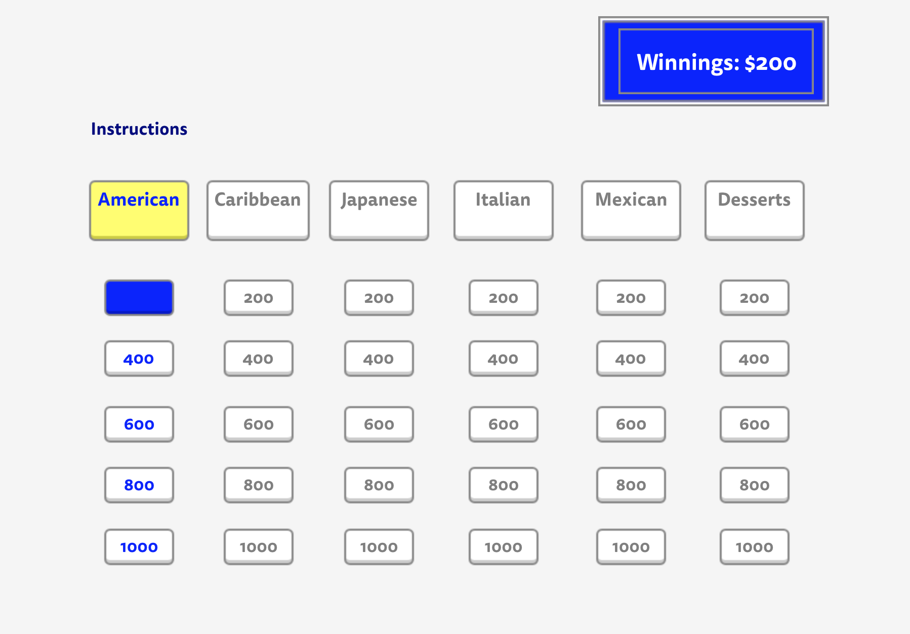
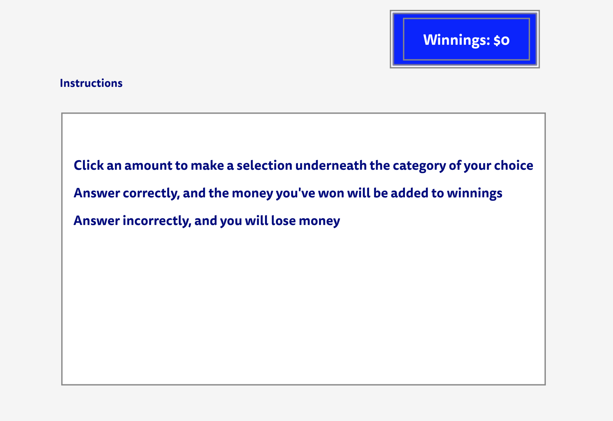
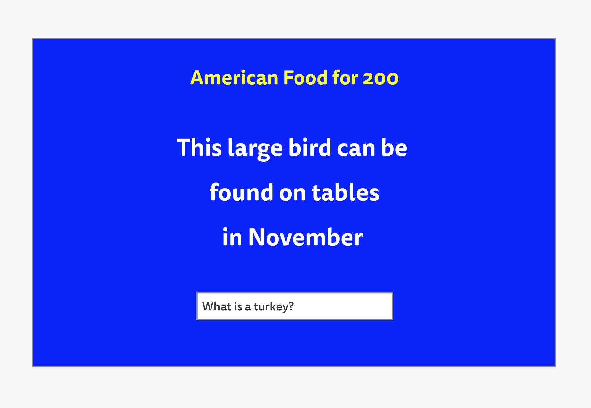

# Jeopardy Project

**Link to Deployed App:** <http://practical-spence-a5b035.bitballoon.com/>  

**Link to User Stories on Trello:** <https://trello.com/b/yaXc4pEC/ajs-jeopardy>

## Project Description

The goal of this project was to create a game that would allow the user to play a game of Jeopardy. This is a quiz game where the user gets to choose a question from a variety of topics while choosing a dollar amount ($200 to $1000) to attempt to win. The questions are phrased as answers and the user inputs a question to attempt to win. 

## Technologies Used

  * Languages - HTML5, CSS3, Javascript
  * Wireframe - Balsamiq
  * Project Planning & User Stories - [Trello](https://trello.com/b/yaXc4pEC/ajs-jeopardy)
  * Deployment - Bitballoon - [Bitballoon](http://practical-spence-a5b035.bitballoon.com/)
  * Visual Studio Code
  * iTerm

## Features
 
  * Scoreboard
  * Instructions
  * Disabled Buttons
  * Click Events
  * Hover Effects

## Wireframe

## Additions to a Future Version

  * Style the background
  * Keyframes
  * More challenging questions
  * A game over animation
  * Round 2
  * Add useful commit messages